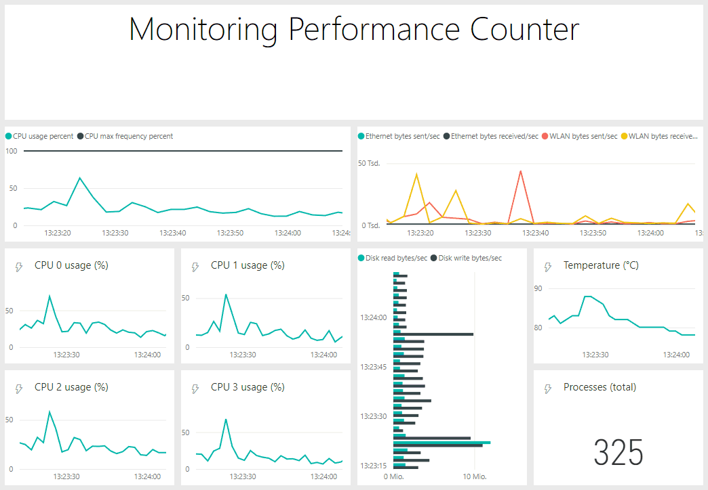
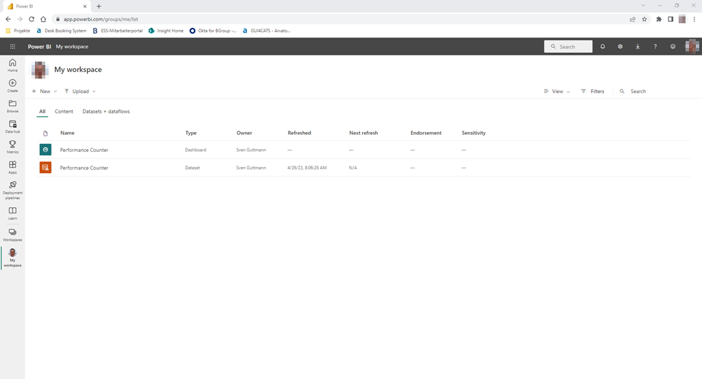
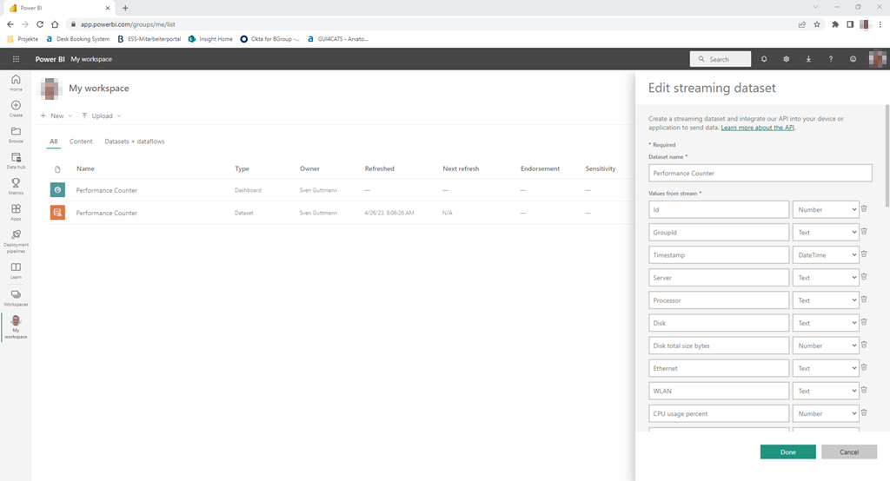
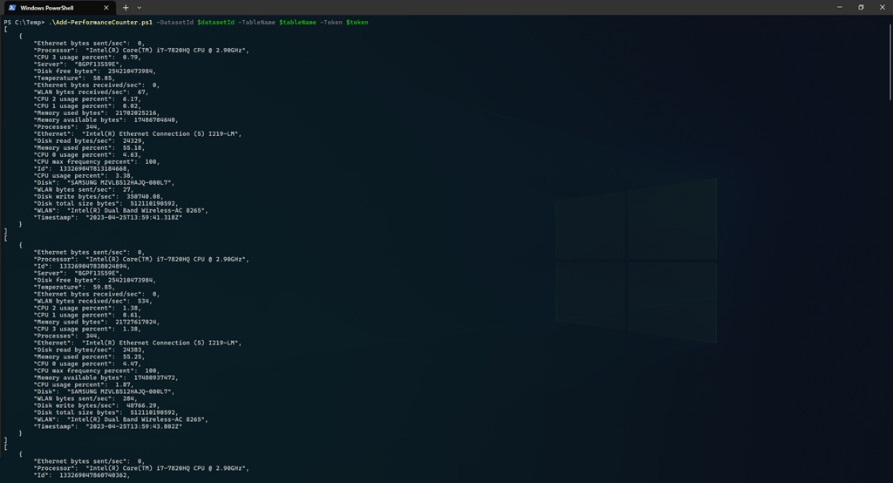
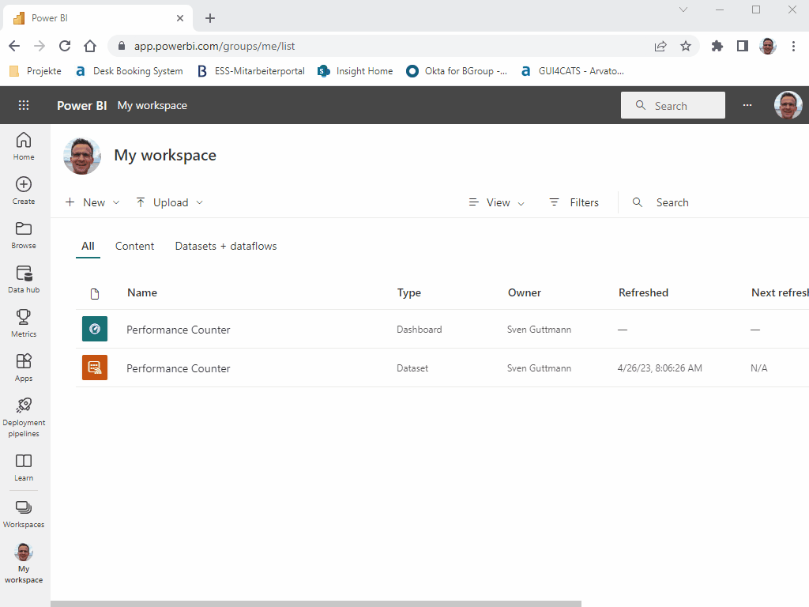
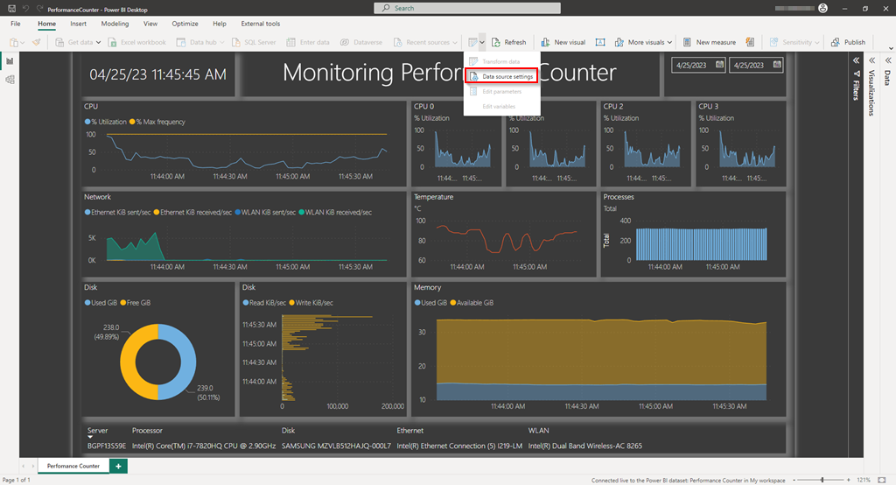
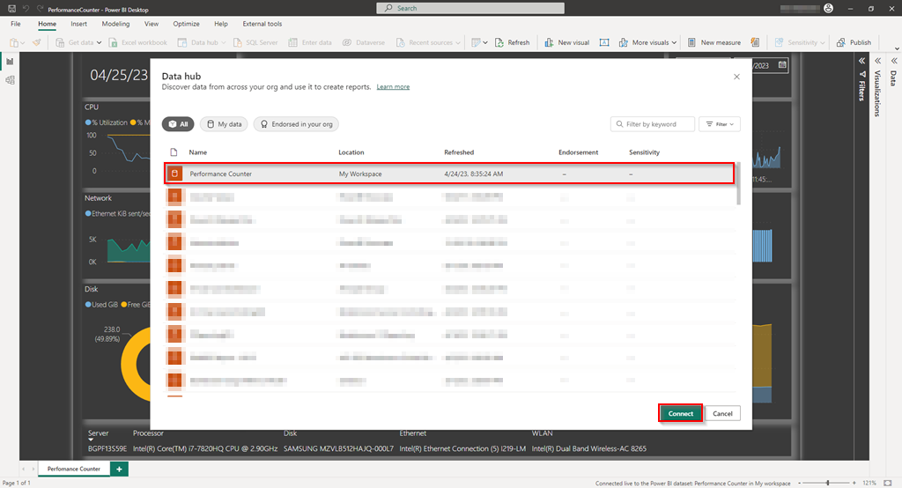
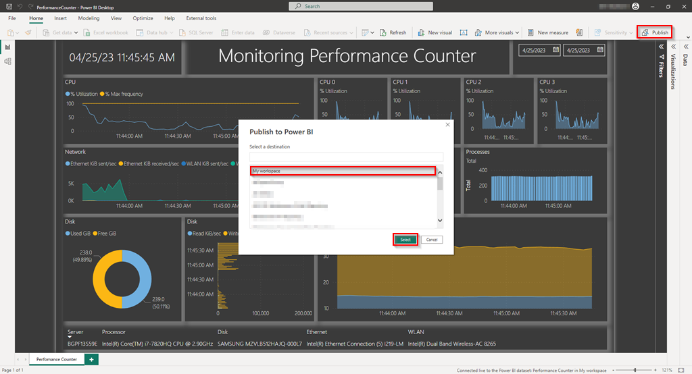

# Power BI - Real-time Dashboard

## Table of Contents

* [Introduction](#introduction)
* [Perfomance Counter](#performance-counter)
* [Power BI Streaming Dataset](#power-bi-streaming-dataset)
* [PowerShell Script](#powershell-script)
* [Customise the Power BI Dashboard](#customise-the-power-bi-dashboard)
* [Power BI Report](#power-bi-report)

## Introduction

The example is intended to show how real-time data can be visualised with Power BI. In order to generate non-random values, the computer's performance counters, e.g. CPU utilisation and temperature, are read out.



## Requirements

* A Power BI licence to log on to https://apps.powerbi.com. The free version is sufficient.
* The [Azure CLI](https://learn.microsoft.com/de-de/cli/azure/) to log in to Azure Active Directory and create a Power BI token.
* [Visual Studio Code](https://code.visualstudio.com/) with a plugin to execute rest calls, e.g. [Rest Client by Huachao Mao](https://marketplace.visualstudio.com/items?itemName=humao.rest-client).
* Optionally the [Power BI Desktop](https://www.microsoft.com/en-us/download/details.aspx?id=58494) for the report.
* The performance counters are queried via the English terms. For this to work, the English language package must be installed under Windows and the language setting for Windows must be changed to English. Alternatively, the PowerShell `Add-PerformanceCounter.ps1` script must be changed to the native language.

## Performance Counter

* CPU utilization, in total and for four cores.
* Temperature of the processor.
* Memory usage.
* Network traffic for the LAN and the WLAN.
* Disk usage, and read and write access.
* Number of processes.

A list of the performance data can be queried with the command Get-Counter -ListSet *. All queryable data for the processor can be determined with the following command.

```ps
Get-Counter -ListSet * | Where-Object { $_.CounterSetName -eq "Processor Information" } | Select-Object -ExpandProperty Counter
```

## Power BI Streaming Dataset

To create the streaming dataset, the following steps are performed.

Generating an Access Token for access to the Power BI Service.

```ps
az login
az account get-access-token --resource https://analysis.windows.net/powerbi/api
```

Creating a Push Streaming Dataset in the Power BI Service.

```json
@token = ********
@datasetName = Performance Counter
@tableName = RealtimeData
POST https://api.powerbi.com/v1.0/myorg/datasets?defaultRetentionPolicy=basicFifo HTTP/1.1
Authorization: Bearer {{token}}
Content-Type: application/json
 
{
  "name": "{{datasetName}}",
  "defaultMode": "PushStreaming",
  "tables": [
    {
      "name": "{{tableName}}",
      "columns": [
        {
          "name": "Id",
          "dataType": "Int64"
        }
      ]
    }
  ]
}
```

Response with Dataset Id.

```json
{
  "@odata.context": "http://wabi-north-europe-g-primary-redirect.analysis.windows.net/v1.0/myorg/$metadata#datasets/$entity",
  "id": "a119a912-fe59-4e18-87c3-6568b6866507",
  "name": "Performance Counter",
  "upstreamDatasets": [],
  "users": []
}
```

Create the table in the dataset.

```json
@token = ********
@datasetId = a119a912-fe59-4e18-87c3-6568b6866507
@tableName = RealtimeData
PUT https://api.powerbi.com/v1.0/myorg/datasets/{{datasetId}}/tables/RealtimeData HTTP/1.1
Authorization: Bearer {{token}}
Content-Type: application/json
 
{
  "name": "{{tableName}}",
  "columns": [
    {
      "name": "Id",
      "dataType": "Int64"
    },
    {
      "name": "GroupId",
      "dataType": "String"
    },
    {
      "name": "Timestamp",
      "dataType": "DateTime"
    },
    {
      "name": "Server",
      "dataType": "String"
    },
    {
      "name": "Processor",
      "dataType": "String"
    },
    {
      "name": "Disk",
      "dataType": "String"
    },
    {
      "name": "Disk total size bytes",
      "dataType": "Int64"
    },
    {
      "name": "Ethernet",
      "dataType": "String"
    },
    {
      "name": "WLAN",
      "dataType": "String"
    },
    {
      "name": "CPU usage percent",
      "dataType": "Double"
    },
    {
      "name": "CPU 0 usage percent",
      "dataType": "Double"
    },
    {
      "name": "CPU 1 usage percent",
      "dataType": "Double"
    },
    {
      "name": "CPU 2 usage percent",
      "dataType": "Double"
    },
    {
      "name": "CPU 3 usage percent",
      "dataType": "Double"
    },
    {
      "name": "CPU max frequency percent",
      "dataType": "Double"
    },
    {
      "name": "Temperature",
      "dataType": "Double"
    },
    {
      "name": "Memory available bytes",
      "dataType": "Int64"
    },
    {
      "name": "Memory used bytes",
      "dataType": "Int64"
    },
    {
      "name": "Memory used percent",
      "dataType": "Double"
    },
    {
      "name": "Ethernet bytes received/sec",
      "dataType": "Int64"
    },
    {
      "name": "Ethernet bytes sent/sec",
      "dataType": "Int64"
    },
    {
      "name": "WLAN bytes received/sec",
      "dataType": "Int64"
    },
    {
      "name": "WLAN bytes sent/sec",
      "dataType": "Int64"
    },
    {
      "name": "Disk free bytes",
      "dataType": "Int64"
    },
    {
      "name": "Disk free space percent",
      "dataType": "Double"
    },
    {
      "name": "Disk read bytes/sec",
      "dataType": "Double"
    },
    {
      "name": "Disk write bytes/sec",
      "dataType": "Double"
    },
    {
      "name": "Processes",
      "dataType": "Int64"
    }
  ]
}
```

Write test data set to the dataset.

```json
@token = ********
@datasetId = a119a912-fe59-4e18-87c3-6568b6866507
@tableName = RealtimeData
POST https://api.powerbi.com/v1.0/myorg/datasets/{{datasetId}}/tables/{{tableName}}/rows
Authorization: Bearer {{token}}
Content-Type: application/json
 
[
    {
        "Id":  133268025267401716,
        "Timestamp":  "2023-04-24T09:35:26.740Z",
        "Server":  "BGPF13S59E",
        "Processor":  "Intel(R) Core(TM) i7-7820HQ CPU @ 2.90GHz",
        "Disk":  "SAMSUNG MZVLB512HAJQ-000L7",
        "Disk total size bytes":  512110190592,
        "Ethernet":  "Intel(R) Ethernet Connection (5) I219-LM",
        "WLAN":  "Intel(R) Dual Band Wireless-AC 8265",
        "CPU usage percent":  12.64,
        "CPU 0 usage percent":  16.51,
        "CPU 1 usage percent":  11.1,
        "CPU 2 usage percent":  13.42,
        "CPU 3 usage percent":  5.69,
        "CPU max frequency percent":  100,
        "Temperature":  71.85,
        "Memory available bytes":  17789517824,
        "Memory used bytes":  18920972288,
        "Memory used percent":  48.11,
        "Ethernet bytes received/sec":  0,
        "Ethernet bytes sent/sec":  0,
        "WLAN bytes received/sec":  117548,
        "WLAN bytes sent/sec":  102017,
        "Disk free bytes":  256499515392,
        "Disk read bytes/sec":  0,
        "Disk write bytes/sec":  240653.11,
        "Processes":  317
    }
]
```

Creating the Dashboard.

```json
@token = ********
@dashboardName = Performance Counter
POST https://api.powerbi.com/v1.0/myorg/dashboards
Authorization: Bearer {{token}}
Content-Type: application/json
 
{
  "name": "{{dashboardName}}"
}
```

The dashboard and the dataset are now visible in the Power BI service.



The columns are displayed via the Edit option in the context menu of the dataset and can also be adjusted via the GUI if necessary.



## PowerShell Script

The following PowerShell script can be used to read out the performance data and add it to the streaming dataset.

* Parameters: DatasetId, TableName und Token.
* Define HTTP endpoint and header for the rest call.
* Set some default values.
* Definition of the performance counters to be queried.
* Endless loop in which the performance counters are read, converted and stored in an array and then added to the dataset.
* End the loop with CTRL-C

```ps
<#
.SYNOPSIS
Add-PerformanceCounter.

.DESCRIPTION
Adds performance counter to a Power BI streaming dataset.

.PARAMETER DatasetId
Id of the Power BI streaming dataset.

.PARAMETER TableName
Table name within the Power BI streaming dataset.

.PARAMETER Token
Bearer token for authentication.

.EXAMPLE
Add-PerformanceCounter.ps1 -DatasetId ********-****-****-****-************ -TableName RealtimeData -Token ********************

.NOTES
Run the following commands to generate an access token
az login
az account get-access-token --resource https://analysis.windows.net/powerbi/api
#>

# script parameters
[CmdletBinding(SupportsShouldProcess = $true)]
param(
    [Parameter(Mandatory = $true)]
    [ValidateNotNullOrEmpty()]
    [String]$DatasetId,

    [Parameter(Mandatory = $true)]
    [ValidateNotNullOrEmpty()]
    [String[]]$TableName,

    [Parameter(Mandatory = $true)]
    [ValidateNotNullOrEmpty()]
    [String[]]$Token
)

$endpoint = "https://api.powerbi.com/v1.0/myorg/datasets/${DatasetId}/tables/${TableName}/rows"

$headers = @{
    Authorization = "Bearer $Token"
    ContentType   = "application/json"
}

$computerName = $env:COMPUTERNAME
$processorName = (Get-WmiObject Win32_Processor).Name
$diskName = (Get-Disk).FriendlyName
$diskTotalSizeBytes = (Get-Disk).Size
$ethernetName = Get-NetAdapter | Where-Object { $_.Name -eq 'Ethernet' } | Select-Object -ExpandProperty InterfaceDescription
$wlanName = Get-NetAdapter | Where-Object { $_.Name -eq 'WLAN' } | Select-Object -ExpandProperty InterfaceDescription

$performanceCounter = @(
    '\Processor Information(*)\% Processor Time',
    '\Processor Information(*)\% of Maximum Frequency',
    '\Thermal Zone Information(*)\Temperature',
    '\Memory\Available Bytes',
    '\Memory\Committed Bytes',
    '\Memory\% Committed Bytes In Use',
    '\Network Interface(*)\Bytes Received/sec',
    '\Network Interface(*)\Bytes Sent/sec',
    '\LogicalDisk(*)\Free Megabytes',
    '\LogicalDisk(*)\% Free Space',
    '\LogicalDisk(*)\Disk Read Bytes/sec',
    '\LogicalDisk(*)\Disk Write Bytes/sec',
    '\Process(*)\% Processor Time'
)

[System.Collections.Hashtable]$payload = @{}

while ($true) {
    $performanceCounterValues = Get-Counter -Counter $performanceCounter -SampleInterval 2

    $timestampUTC = ($performanceCounterValues.Timestamp).ToUniversalTime()
    $timestampString = $timestampUTC.ToString('yyyy-MM-ddTHH:mm:ss.fffZ')  # use this format to refresh the dashboard constantly
    $id = $timestampUTC.ToFileTimeUtc()

    $payload.Clear()
    $payload.Add('Id', $id)
    $payload.Add('Timestamp', $timestampString)
    $payload.Add('Server', $computerName)
    $payload.Add('Processor', $processorName)
    $payload.Add('Disk', $diskName)
    $payload.Add('Disk total size bytes', $diskTotalSizeBytes)
    $payload.Add('Ethernet', $ethernetName)
    $payload.Add('WLAN', $wlanName)

    $counterSamples = $performanceCounterValues | Select-Object -ExpandProperty CounterSamples
    $numberOfProcesses = -1 # ignore _total
    foreach ($counterSample in $counterSamples) {
        $value = $counterSample.CookedValue
        if (!$value) {
            $value = 0
        }
        
        if ($counterSample.Path -eq "\\$($computerName.ToLower())\processor information(0,_total)\% processor time") {
            $payload.Add('CPU usage percent', [Math]::Round($value, 2))
        }
        elseif ($counterSample.Path -eq "\\$($computerName)\processor information(0,0)\% processor time") {
            $payload.Add('CPU 0 usage percent', [Math]::Round($value, 2))
        }
        elseif ($counterSample.Path -eq "\\$($computerName)\processor information(0,1)\% processor time") {
            $payload.Add('CPU 1 usage percent', [Math]::Round($value, 2))
        }
        elseif ($counterSample.Path -eq "\\$($computerName)\processor information(0,2)\% processor time") {
            $payload.Add('CPU 2 usage percent', [Math]::Round($value, 2))
        }
        elseif ($counterSample.Path -eq "\\$($computerName)\processor information(0,3)\% processor time") {
            $payload.Add('CPU 3 usage percent', [Math]::Round($value, 2))
        }
        elseif ($counterSample.Path -eq "\\$($computerName)\processor information(0,_total)\% of maximum frequency") {
            $payload.Add('CPU max frequency percent', [Math]::Round($value, 2))
        }
        elseif ($counterSample.Path -eq "\\$($computerName)\thermal zone information(\_tz.thm0)\temperature") {
            $payload.Add('Temperature', [Math]::Round($($value - 273.15), 2)) # Kelvin to Celsius
        }
        elseif ($counterSample.Path -eq "\\$($computerName)\memory\available bytes") {
            $payload.Add('Memory available bytes', $value)
        }
        elseif ($counterSample.Path -eq "\\$($computerName)\memory\committed bytes") {
            $payload.Add('Memory used bytes', $value)
        }
        elseif ($counterSample.Path -eq "\\$($computerName)\memory\% committed bytes in use") {
            $payload.Add('Memory used percent', [Math]::Round($value, 2))
        }
        elseif ($counterSample.Path -eq "\\$($computerName)\network interface(intel[r] ethernet connection [5] i219-lm)\bytes received/sec") {
            $payload.Add('Ethernet bytes received/sec', [Math]::Round($value, 0))
        }
        elseif ($counterSample.Path -eq "\\$($computerName)\network interface(intel[r] ethernet connection [5] i219-lm)\bytes sent/sec") {
            $payload.Add('Ethernet bytes sent/sec', [Math]::Round($value, 0))
        }
        elseif ($counterSample.Path -eq "\\$($computerName)\network interface(intel[r] dual band wireless-ac 8265)\bytes received/sec") {
            $payload.Add('WLAN bytes received/sec', [Math]::Round($value, 0))
        }
        elseif ($counterSample.Path -eq "\\$($computerName)\network interface(intel[r] dual band wireless-ac 8265)\bytes sent/sec") {
            $payload.Add('WLAN bytes sent/sec', [Math]::Round($value, 0))
        }
        elseif ($counterSample.Path -eq "\\$($computerName)\logicaldisk(c:)\free megabytes") {
            $payload.Add('Disk free bytes', $value * 1024 * 1024)
        }
        elseif ($counterSample.Path -eq "\\$($computerName)\\logicaldisk(c:)\% free space") {
            $payload.Add('Disk free space percent', [Math]::Round($value, 0))
        }
        elseif ($counterSample.Path -eq "\\$($computerName)\logicaldisk(c:)\disk read bytes/sec") {
            $payload.Add('Disk read bytes/sec', [Math]::Round($value, 0))
        }
        elseif ($counterSample.Path -eq "\\$($computerName)\logicaldisk(c:)\disk write bytes/sec") {
            $payload.Add('Disk write bytes/sec', [Math]::Round($value, 2))
        }
        elseif ($counterSample.Path -like "*process(*)\% processor time*") {
            $numberOfProcesses++
        }
        # else { Write-Host $counterSample.Path }
    }

    $payload.Add('Processes', $numberOfProcesses)

    Write-Host "$(ConvertTo-Json @($payload))"
    
    $null = Invoke-RestMethod -Method Post -Uri "$endpoint" -Headers $headers -Body (ConvertTo-Json @($payload)) -TimeoutSec 10
}
```

Set the environment variables.

```ps
$datasetId = "a119a912-fe59-4e18-87c3-6568b6866507"
$tableName = "RealtimeData"
$token = "********"
```

Call the script

```ps
.\Add-PerformanceCounter.ps1 -DatasetId $datasetId -TableName $tableName -token $token
```

The data that is written to the dataset is also written to the console.



## Customise the Power BI Dashboard

Tiles are added to the Power BI Dashboard as follows.



## Power BI Report

The Power BI Dashboard is quite limited in terms of tile customisation and visualization. To get something more out of the data visually, there is still a Power BI report (`./src/pbi/PerformanceCounter.pbix`).

First, customise the data source. If the report does not show any data, it may be because the time period (top right) is not selected correctly.





The report can then be published to the Power BI service.



## Sources

* [Power BI Rest-API](https://learn.microsoft.com/en-us/rest/api/power-bi/).
* [ScreenToGif](https://www.screentogif.com/) to create the animated GIFs.